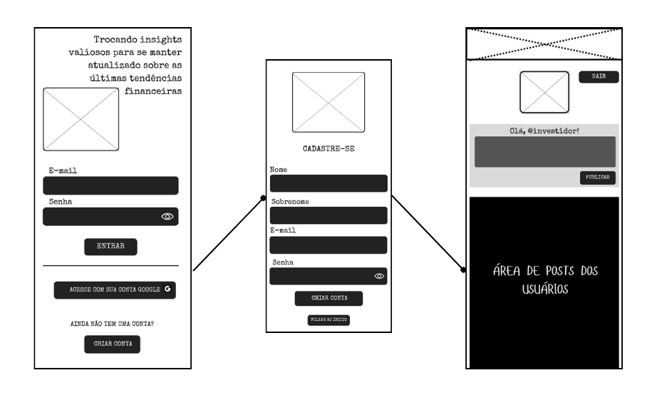
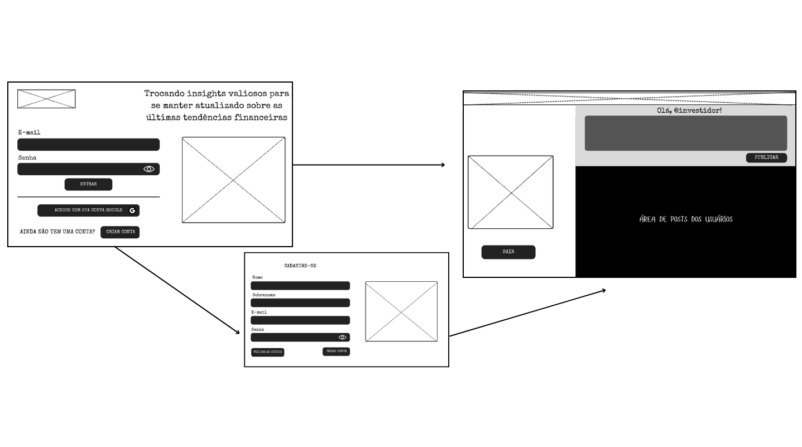
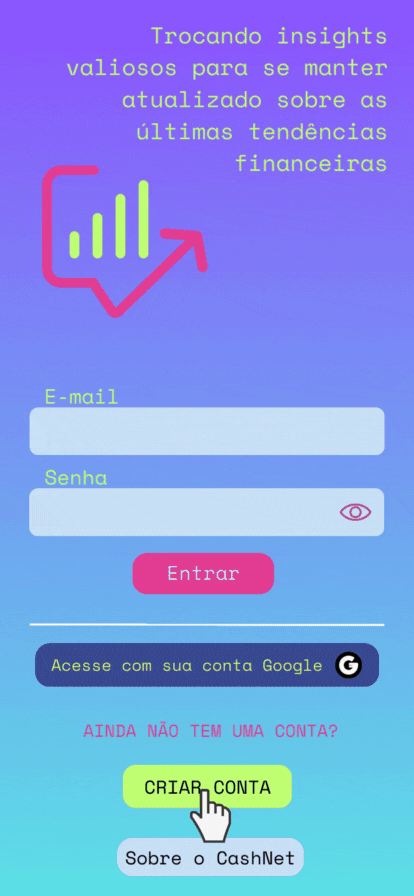
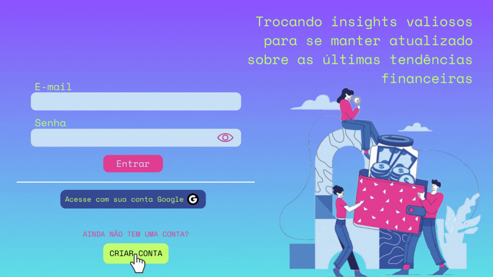
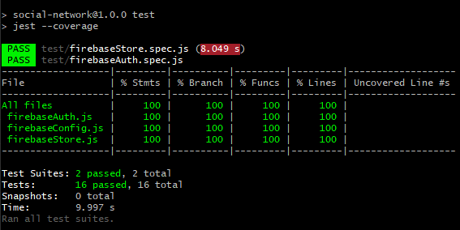

# CashNet - Rede Social

## Índice

* [1. Prefácio](#1-prefácio)
* [2. Resumo do projeto](#2-resumo-do-projeto)
* [3. Histórias de Usuário](#3-histórias-de-usuários)
* [4. Desenho de interface do usuário](#4-desenho-de-interface-do-usuário)
* [5. Interface do projeto e objetivos alcançados](#5-interface-do-projeto-e-objetivos-alcançados)
* [6. Testes unitários](#6-testes-unitários)
* [7. Especificações técnicas](#7-especificações-técnicas)
* [8. Implementações futuras](#8-implementações-futuras)
* [9. Referências](#9-referências)
* [10. Desenvolvedor](#10-desenvolvedor)

***

## 1. Prefácio

Este projeto foi desenvolvido como parte do bootcamp da Laboratória e consiste em um projeto de nível 3 de um catálogo de projetos de complexidade crescente, associados a objetivos de aprendizagem concretos. Portanto, se trata de uma aplicação web, tendo como principal objetivo permitir ao usuário acessar o site da Rede Social, criar sua conta de acesso, fazer login, tanto com email e senha quanto com login do Google. Além disso o usuário poderá criar, editar e deletar o post criado, bem como dar _likes_ em seus posts e de outros usuários.

## 2. Resumo do projeto

O produto em questão é uma rede social desenvolvida para atender às necessidades daqueles que desejam aprender mais sobre mercado financeiro e compartilhar insights sobre novidades, atualizações e dicas financeiras,focada na interação e aprendizado sobre finanças e o mercado financeiro. Projetada para entusiastas, profissionais e estudantes, a plataforma proporciona discussões aprofundadas, troca de insights e atualização sobre tendências econômicas. Seu objetivo é preencher lacunas de conhecimento financeiro, reduzir o isolamento no mercado e simplificar estratégias complexas. Mais que uma rede, é um espaço colaborativo que potencializa o entendimento financeiro e favorece decisões informadas em um cenário financeiro dinâmico.

_Slogan_: "Conectando saberes financeiros"

## 3. Histórias de usuários

As histórias de usuário definiram os requisitos principais para a criação da Rede Social CashNet. Cada história se concentra em uma funcionalidade específica, tornando a experiência do usuário mais completa e agradável.

### História de Usuário 1 - Gerenciar Conta

“Como usuário, quero poder criar uma conta com email e senha e fazer login com uma conta do Google.”

#### Critérios de Aceitação:
  * Posso criar uma conta com sucesso utilizando meu email e senha.
  * Posso fazer login com sucesso utilizando meu email e senha.
  * Posso fazer login com minha conta do Google.

#### Definição de Pronto (DoD - Definition of Done):
A História de usuário _"Gerenciar Conta"_ estará pronta quando:

* O usuário pode criar uma conta de forma bem-sucedida utilizando seu email e senha, garantindo que o processo de cadastro funcione conforme o esperado, sem erros ou falhas.
* O usuário é capaz de fazer login com sucesso na plataforma utilizando seu email e senha previamente cadastrados, assegurando que a autenticação ocorra corretamente.
* O usuário pode efetuar login com êxito utilizando sua conta do Google, garantindo a integração efetiva e sem problemas com o sistema de autenticação do Google.
*	A história de usuário passar por revisão e aprovação em teste unitário, assegurando que atende aos critérios de aceitação definidos.

### História de Usuário 2 - Publicar conteúdo
“Como usuário, quero poder criar e compartilhar posts contendo texto e links relevantes. Também quero poder editar ou excluir meus próprios posts”.

#### Critérios de Aceitação:
* Posso criar e publicar posts contendo texto ou links.
* Posso editar meus próprios posts e salvar as alterações.
* Posso excluir meus próprios posts após receber uma confirmação.

#### Definição de Pronto (DoD - Definition of Done):
A História de usuário _"Publicar conteúdo"_ estará pronta quando:

* O usuário é capaz de criar e publicar posts na plataforma, incluindo a inserção de texto ou links relevantes, garantindo que a funcionalidade de criação e publicação funcione sem erros.
* O usuário pode editar seus próprios posts de maneira eficaz, incluindo a capacidade de salvar as alterações feitas no conteúdo do post, assegurando que as modificações sejam refletidas adequadamente.
* O usuário pode excluir seus próprios posts após receber uma confirmação, evitando exclusões acidentais e fornecendo uma camada adicional de segurança para a operação de exclusão.

### História de Usuário 3 - Interagir com conteúdo
"Como usuário, quero poder interagir com os posts de outras pessoas, dando likes e removendo likes que já dei, além de visualizar a contagem de likes. Também quero receber um aviso quando tentar publicar um post vazio.”

#### Critérios de Aceitação:

* Posso dar likes em posts de outros usuários.
* Posso remover os likes que já dei em posts.
* A contagem de likes é visível em todos os posts.
* Ao tentar publicar um post vazio, recebo uma mensagem de erro apropriada.

#### Definição de Pronto (DoD - Definition of Done):
A História de usuário _"Interagir com conteúdo"_ estará pronta quando:
* O usuário é capaz de dar likes em posts de outros usuários, demonstrando interação e apreciação pelo conteúdo publicado por seus pares.
* O usuário pode remover os likes que já deu em posts, garantindo flexibilidade e controle sobre suas interações na plataforma.
* A contagem de likes é exibida de forma visível em todos os posts, permitindo que os usuários vejam o número de likes recebidos por cada post.
* Quando o usuário tenta publicar um post vazio, ele recebe uma mensagem de erro apropriada, alertando sobre a impossibilidade de postar conteúdo sem texto ou links.

### História de Usuário 4 - Compartilhar conteúdos financeiros
“Como usuário, quero poder compartilhar links de fóruns, blogs, dicas de economia e novidades sobre o mercado financeiro.”

#### Critérios de Aceitação:
* Posso compartilhar links de fóruns, blogs e sites financeiros.
* Posso compartilhar dicas de economia.
* Posso compartilhar novidades sobre o mercado financeiro.
* Os posts compartilhados com links exibem corretamente as descrições e os links.

#### Definição de Pronto (DoD - Definition of Done):
A História de usuário _"Compartilhar conteúdos financeiros"_ estará pronta quando:
* O usuário é capaz de compartilhar links de fóruns, blogs e sites financeiros, garantindo a funcionalidade adequada de compartilhamento de links na plataforma.
* O usuário pode compartilhar dicas de economia de forma eficiente e funcional, assegurando que as dicas sejam publicadas corretamente.
* O usuário é capaz de compartilhar novidades relevantes sobre o mercado financeiro, assegurando a funcionalidade correta de compartilhamento de notícias.
* Os posts compartilhados com links exibem corretamente as descrições e os links, garantindo uma apresentação adequada e legível do conteúdo compartilhado.

### História de Usuário 5 - Acesso multiplataforma
"Como usuário, eu quero poder acessar o site da plataforma de qualquer dispositivo, como computadores, tablets e smartphones, para ter uma experiência agradável independentemente do dispositivo que estou usando".

#### Critérios de Aceitação:
* A plataforma deve ser responsiva, permitindo que se adapte automaticamente ao tamanho e resolução da tela do dispositivo.
* Ao acessar o site a partir de um dispositivo, a interface e o layout devem se reorganizar de maneira adequada para garantir uma boa experiência ao usuário.
* A navegação, elementos interativos e conteúdo da plataforma devem ser facilmente acessíveis e utilizáveis em diferentes dispositivos.
* As funcionalidades da plataforma devem permanecer ativas em todos os dispositivos, garantindo que os usuários tenham acesso a todos os recursos.

#### Definição de Pronto (DoD - Definition of Done):
A História de usuário _"Acesso multiplataforma"_ estará pronta quando:
* A plataforma se adapta automaticamente ao tamanho e resolução da tela do dispositivo utilizado, garantindo uma experiência consistente e amigável para o usuário, independentemente do dispositivo.
* Ao acessar o site a partir de diferentes dispositivos, a interface e o layout se reorganizam de maneira adequada para garantir uma experiência positiva e coesa para o usuário.
*A navegação, elementos interativos e conteúdo da plataforma são facilmente acessíveis e utilizáveis em diferentes dispositivos, atendendo às necessidades de usabilidade para uma variedade de tamanhos de tela.
*Todas as funcionalidades da plataforma permanecem ativas e plenamente utilizáveis em todos os dispositivos, garantindo que os usuários tenham acesso a todos os recursos, independentemente do meio de acesso.

## 4. Desenho de interface do usuário 

O desenho da interface do usuário (UI) é uma etapa fundamental de extrema importância pois é o ponto de interação entre os usuários e o produto digital. Dessa forma, os protótipos desenvolvidos para esta aplicação web buscaram otimizar a experiência do usuário, tornando a sua interação intuitiva, eficiente e agradável. Portanto, os protótipos de baixa fidelidade e protótipos de alta fidelidade foram desenvolvidos utilizando como ferramenta de visual designer a plataforma online, Canva. 

### Protótipo de baixa fidelidade (mobile)

<h1 align = 'center'>
  
</h1>

### Protótipo de baixa fidelidade (desktop)

<h1 align = 'center'>
  
</h1>

### Protótipo de alta fidelidade (mobile)

<h1 align = 'center'>
  
</h1>

### Protótipo de alta fidelidade (desktop)

<h1 align = 'center'>
  
</h1>

### Testes de usabilidade

Os testes de usabilidade foram realizados com o intuito de fazer uma análise sobre a interação do usuário com a aplicação desenvolvida. Buscamos, portanto, entender se o produto criado era fácil de usar, agradável visualmente e capazes de atender às necessidades e expectativas dos usuários, resultando em uma experiência geral satisfatória. Dessa forma, desenvolvemos um protótipo de alta fidelidade, no qual, o usuário pode interagir e ao final preencher um formulário com perguntas que nos informavam sobre sua experiência de usuário com a aplicação. Como sugestões de melhorias, indicadas pelos usuários, vamos citar duas:
* Aplicar melhoramentos na paleta de cores para melhor contraste dos elementos de primeiro e segundo plano, melhorando assim a visuação da pagina web. 
* Alterar o layout da visualização dos alertas tela enquanto o usuário faz a edição de um post ou sua exclusão.

### Entrevista com usuário

A entrevista com usuário é fundamental para o projeto, pois visa entender as preferências dos usuários em relação a uma plataforma de rede social voltada para o mercado financeiro. As perguntas visam coletar informações sobre o que atrai os usuários, quais funcionalidades são importantes para eles, como valorizam a interação social, a segurança e facilidade de uso, além de identificar o tipo de conteúdo financeiro desejado. Essas respostas ajudaram a adaptar a plataforma para atender às necessidades e expectativas dos usuários, resultando em uma experiência mais satisfatória.

#### Perguntas e respostas da entrevista (Número de entrevistados: 2)

O que te atraiu para nossa plataforma de rede social?

* Resposta 1: Oportunidade de adquirir conhecimento e networking
* Resposta 2: A ideia de aprender sobre finanças.

Quais funcionalidades específicas você espera encontrar na plataforma que sejam importantes para sua experiência?

* Resposta 1: Experiencias reais, oportunidade de negócios e dicas de mercados e materiais didáticos.
* Resposta 2: Dicas sobre gestão financeira do dia-a-dia.

Quão importante é para você a capacidade de compartilhar e discutir novidades do mercado financeiro na plataforma?

* Resposta 1: É uma oportunidade impar de conhecer novas pessoas com o mesmo foco.
* Resposta 2: Muito importante, posso trocar e adquirir conhecimento.

Como você vê a importância de poder dar likes em posts e ter uma contagem de likes visível?

* Resposta 1: A importância que traz é o engajamento de um assunto específico.
* Resposta 2: Acho importante para saber como o post está impactando as pessoas.

Você se preocupa com a segurança e a facilidade de uso da plataforma, como a opção de fazer login com sua conta do Google e a recuperação de senha?

* Resposta 1: Sim, pois há a preocupação com a privacidade dos meus dados.
* Resposta 2: Sim, segurança e facilidade de login são fatores determinantes.

Que tipo de conteúdo financeiro você mais gostaria de ver e compartilhar na plataforma?

* Resposta 1: Investimentos em potencial.
* Resposta 2: Dicas sobre como controlar as finanças do dia-a-dia e dicas sobre investimentos rentáveis e de baixo risco.

Como você enxerga o papel da interação social na plataforma?

* Resposta 1: Vejo como positiva a aproximação de pessoas com conhecimento diversos voltado ao mesmo objetivo.
* Resposta 2: Acho importante essa troca de informações visto que esse assunto, apesar de importantíssimo, não é aprendido na escola, por exemplo. Ter esse espaço é muito legal.

Há alguma outra funcionalidade ou recurso que você considera importante para uma experiência ideal na plataforma?

* Resposta 1: Uma funcionalidade importante é a de denuncia de posts golpistas.
* Resposta 2:  Acho que não. Todas as funcionalidades já estão englobadas no escopo.

## 5. Interface do projeto e objetivos alcançados

O CashNet é um projeto de rede social voltado para a interação, aprendizado e compartilhamento de conhecimentos relacionados a finanças e o mercado financeiro. Projetado para atender tanto a entusiastas quanto a profissionais experientes do setor financeiro, o CashNet oferece uma plataforma colaborativa que permite aos usuários se envolverem em discussões aprofundadas sobre temas financeiros, trocar insights valiosos e se manterem atualizados sobre as últimas tendências econômicas.

Na interface da aplicação, os usuários podem criar uma conta com email e senha, além de realizar login usando uma conta do Google, proporcionando flexibilidade e segurança no acesso à plataforma. Também podem criar e compartilhar posts contendo texto e links relevantes, editando e excluindo seus próprios posts conforme desejado, além de poderem interagir com os posts de outras pessoas, dando e removendo likes, visualizando a contagem de likes, e recebendo alertas ao tentar publicar um post vazio. A plataforma é responsiva, adaptando-se automaticamente a diferentes dispositivos, como computadores, tablets e smartphones, proporcionando uma experiência agradável e funcional em qualquer dispositivo utilizado.

### Objetivos gerais alcançados no projeto:

[✔] Permitir aos usuários fazer login com e-mail e senha - Firebase;

[✔] Permitir aos usuários fazer login com Google - Firebase;

[✔] Permitir aos usuários a criação de um novo cadastro com e-mail e senha - Firebase;

[✔] Permitir ao usuário interagir dentro da aplicação, curtindo posts, compartilhando postos, editando seu post post e podendo até mesmo excluir - Firebase;

[✔] Ser responsivo (_mobile first_), ou seja, deve ser visualizada sem problemas a partir de diversos tamanhos de tela: celulares, tablets, notebooks, etc.

[✔] Ser um SPA;

[✔] Que a interface siga os fundamentos de visual design;

[✔] Interação com banco de dados externos - Firebase;

[✔] Testes unitários cobrirem um mínimo de 70% de statements, functions, lines e branches;

[✔] Uso de Mocks e espiões.

## 6. Teste unitários

Para este projeto foram desenvolvidos dois _boilerplate_ que inclui testes unitários do Firebase Authentication e Firebase Firestore. Assim, foram escritos testes unitários para as funções encarregadas de _criar conta_, _fazer login_, _criar um post_, _curtir_, _descurtir_, _editar_, _excluir_ o post, assim como _ordenar_ os post em ordem decrescente.

Os testes unitários realizados obtiveram uma cobertura de 100% de _statements_ (_sentenças_), _functions_ (_funções_), _lines_ (_linhas_), e _branches_ (_ramos_) dos arquivos `src/firebase/firebaseAuth.js`, `src/firebase/firebaseConfig.js` e, `src/firebase/firebaseStore.js`, no qual contém as funções referentes a esse projeto.

<h1 align = 'center'>
  
</h1>

## 7. Especificações  técnicas

O projeto foi desenvolvido utilizando como ferramentas e tecnologias:

* HTML5
* CSS3
* JavaScript
* Visual Studio Code
* Node.js
* GitBash
* GitHub
* Firebase
* Vite
* Jest
* Canva

## 8. Implementações futuras

 _Hacker Edition_

* Criar posts com imagens.
* Procurar usuários, adicionar e excluir "amigos".
* Definir a privacidade de _posts_ (público ou apenas para amigos).
* Permitir ver na linha do tempo de usuários "não amigos" apenas os posts
  públicos.
* Permitir comentar ou responder a uma postagem.
* Editar perfil.

## 9. Referências

#### Imgens:

* Logo CashNet - [Canva](https://www.canva.com/design/DAFtHxhR-1E/yGKiovQlIJwp6HSSRgx3Aw/edit)
* Logo Desktop Pagina Inicial - [Vecteezy](https://pt.vecteezy.com/fotos-gratis)

#### Ícones:

* Menu - [Google ícons](https://fonts.google.com/icons?selected=Material+Symbols+Outlined:menu:FILL@0;wght@400;GRAD@0;opsz@24&icon.query=menu)
* House - [Google ícons](https://fonts.google.com/icons?selected=Material+Symbols+Outlined:house:FILL@0;wght@400;GRAD@0;opsz@24&icon.query=home)
* Info - [Google ícons](https://fonts.google.com/icons?selected=Material+Symbols+Outlined:info:FILL@0;wght@400;GRAD@0;opsz@24&icon.query=Info)
* Keyboard_double_arrow_up - [Google ícons](https://fonts.google.com/icons?selected=Material+Symbols+Outlined:keyboard_double_arrow_up:FILL@0;wght@400;GRAD@0;opsz@24&icon.query=Keyboard_double_arrow_up)
* Google logo - [Logo PNG](https://logopng.com.br/logos/google-37.png)

#### Fontes:

* Exo 2 - [Google Fonts](https://fonts.google.com/specimen/Exo+2)

## 10. Desenvolvedor

* Made with 💛 by BIANCA BEZERRA 💻 [See my LinkedIn](https://www.linkedin.com/in/bianca-bezerra-63447b160/)